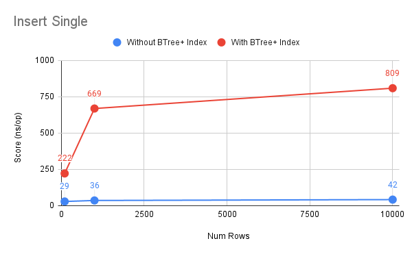
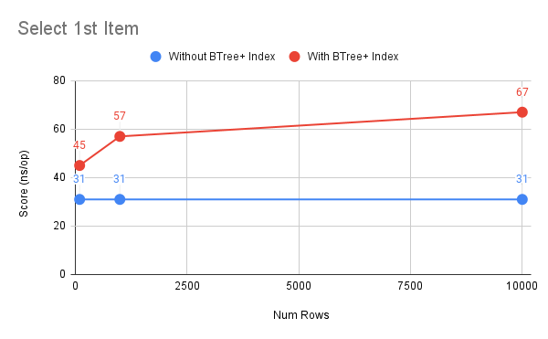
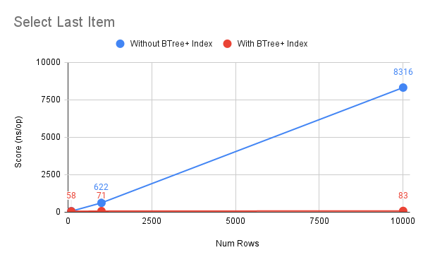

# FSGB - Rendu simulation table SQL

Vous trouverez dans ce repository le rendu de notre groupe simulant une table SQL :
- AGLAE Sebastien
- CHIAPPE Mike
- HAMDI Ons
- FERUGLIO Téo
- LAPSHINA Valeriaa

Le programme simule une table avec 4 colonnes : 
- id: Clé primaire
- email: Unique
- nom: Texte
- adresse: Texte

Le programme permet de :
- Ajouter une ligne via les champs de saisie
- Supprimer une ligne par son id
- Ajouter x lignes aléatoirement
- Visualiser la table par les valeurs des colonnes :
  - si la table utilise un index, alors le BTree+ est affiché
  - sinon, la table est affichée sous forme de liste
- Sauvegarder la table dans un fichier (via ObjectOutputStream)
- Charger une table depuis un fichier (via ObjectInputStream)
- Exporter une table dans un fichier CSV
- Importer une table depuis un fichier CSV
- Benchmark de la table (avec et sans index) en utilisant un simple benchmark ou JMH

### Résultats du benchmark testant l'insertion et la recherche avec et sans index BTree+ (JMH)

Voici les résultats qu'on a obtenu en faisant tourner le benchmark sur notre machine (AMD Ryzen 9 5900X, 32GB RAM) :

|     Benchmark    |  size | Score (ns/op) | Mode | Cnt | Error  |
|:----------------:|:-----:|:-------------:|:----:|:---:|:------:|
| insert           | 100   |      29       | avgt | 9   |  ± 1   |
| insert           | 1000  |      36       | avgt | 9   |  ± 9   |
| insert           | 10000 |      42       | avgt | 9   |  ± 10  |
| insertBTree      | 100   |      222      | avgt | 9   |  ± 7   |
| insertBTree      | 1000  |      669      | avgt | 9   |  ± 75  |
| insertBTree      | 10000 |      809      | avgt | 9   |  ± 81  |
| selectFirst      | 100   |      31       | avgt | 9   |  ± 1   |
| selectFirst      | 1000  |      31       | avgt | 9   |  ± 1   |
| selectFirst      | 10000 |      31       | avgt | 9   |  ± 1   |
| selectFirstBTree | 100   |      45       | avgt | 9   |  ± 1   |
| selectFirstBTree | 1000  |      57       | avgt | 9   |  ± 2   |
| selectFirstBTree | 10000 |      67       | avgt | 9   |  ± 3   |
| selectLast       | 100   |      65       | avgt | 9   |  ± 2   |
| selectLast       | 1000  |      622      | avgt | 9   |  ± 52  |
| selectLast       | 10000 |     8316      | avgt | 9   | ± 1005 |
| selectLastBTree  | 100   |      58       | avgt | 9   |  ± 2   |
| selectLastBTree  | 1000  |      71       | avgt | 9   |  ± 6   |
| selectLastBTree  | 10000 |      83       | avgt | 9   |  ± 3   |

  
Complexité : Sans index (O(1)) / Avec index (0(log(n)))

  
Complexité : Sans index (O(1)) / Avec index (O(log(n)))

  
Complexité : Sans index (O(n)) / Avec index (O(log(n)))

On peut conclure que l'insertion est plus rapide sans index.  
En revanche, le résultat de la recherche varie en fonction de la taille de la table.  
Si la table est très petite (< 10 éléments) ou qu'on accède souvent aux premiers éléments, la recherche est plus rapide sans index.  
Cependant, si la table est grande (> 100 éléments) et qu'on accède souvent aux derniers éléments, la recherche est plus rapide avec index. La raison est que l'index BTree+ est trié, donc la recherche est plus rapide.